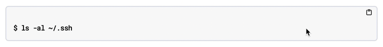

= DocOps audit recommendations
:toc: macro
:toclevels: 2
:kebab-link: https://www.freecodecamp.org/news/programming-naming-conventions-explained/#what-is-kebab-case
:camel-link: https://www.freecodecamp.org/news/programming-naming-conventions-explained/#what-is-camel-case
:snake-link: https://www.freecodecamp.org/news/programming-naming-conventions-explained/#what-is-snake-case

toc::[]

== Overview

This is currently a working document.
The goal is to finalize a set of concrete recommendations based on the DocOps Audit Report provided by OpenDevise.

=== Status definitions

[cols="1,2"]
|===
| Status | Definition

| ✅ **FINALIZED**
| The recommendation has been reviewed and approved by the Docs team.

| ⚠️ **IN PROGRESS**
| The recommendation is still being researched and has not yet been approved by the Docs team.
|===

== AsciiDoc recommendations

[#kebab-case]
=== Standardize on kebab case

Status: ✅ **FINALIZED**

All docs-related naming schemes should formatted in {kebab-link}[kebab case] (e.g. `i-love-kebabs.adoc`) _and_ use lowercase letters.

Currently, a lot of file and directory names are in {camel-link}[camelCase] and {snake-link}[snake_case].
The reason to should migrate to kebab case is because using hyphens "https://developers.google.com/search/docs/crawling-indexing/url-structure[helps users and search engines identify concepts in the URL more easily.]"

At a minimum, every name that appears in a URL should be formatted in kebab case, including:

* `.adoc` file names, as well as all other file names located in the Antora https://docs.antora.org/antora/latest/family-directories/[family directories] (`attachments`, `examples`, `images`, `pages`, and `partials`)
** Exceptions can be made to this rule, but they must be justified.
For example, a file in the `examples` directory may require a specific name for testing purposes.

* https://docs.antora.org/antora/latest/module-directories/[Module directory] names (including module subdirectories)

* https://docs.antora.org/antora/latest/component-name-key/[Component] names

* Custom https://docs.asciidoctor.org/asciidoc/latest/attributes/id/[AsciiDoc IDs] (aka custom anchor links)

In addition, writers should strive to use kebab case wherever they have discretion over the naming scheme of a particular item.
Some examples include:

* Custom AsciiDoc https://docs.antora.org/antora/latest/page/define-and-modify-attributes/[attributes]

* Example file names and resource names

* User-supplied text in example commands

IMPORTANT: The kebab case requirement does not apply when making references in the documentation to literal file or property names.
For example, the https://docs.datastax.com/en/dse/6.8/dse-dev/datastax_enterprise/config/configCassandra_yaml.html#configCassandra_yaml__cluster_name[`cluster_name`] property should use snake case in the documentation, because that's how it appears in the product.

=== Use valid source language syntax on code blocks

Status: ✅ **FINALIZED**

There are several instances in the converted AsciiDoc files where invalid languages have been specified on source blocks (code blocks).
For example, `source,language-bash` and `source,no-highlight` are _invalid_.
These should instead be formatted as `source,bash` and `source,console`, respectively.

That's why it's important that writers only specify languages that are https://github.com/PrismJS/prism/tree/gh-pages/components[supported by the Docs UI syntax highlighting library (PrismJS)].
When an invalid language is specified, the code block not only doesn't get any highlighting, but the user is likely to be presented with inconsistent source code labeling between various code blocks.

When creating a code block, writers must enforce the following standards:

* All code blocks must have a language specified (`[source,<language>]`)
* All console output, such as command results and logs, must use `source,console` as the specified language.
* All basic shell commands, e.g. `cd` or `ls`, must also use `source,console` as the specified language.
** The reason for this is because when a shell prompt character is present, e.g. `$`, the copy button feature doesn't copy the shell prompt character when `source,console` is the specified language.
This is a good thing because it means the user can paste and immediately execute the command in their terminal without first having to delete the shell prompt character.

[NOTE]
====
When `source,console` is the specified language, the code block does not apply any highlighting and does not display a language when the user hovers their mouse over the code block.
_This is by design._
The following example shows the hover behavior of a code block that uses `source,console`:

====

=== Use valid page attribute formatting

Status: ✅ **FINALIZED**

When specifying a https://docs.antora.org/antora/latest/page/page-attributes/[page attribute] (also known as a _document attribute_) the https://docs.asciidoctor.org/asciidoc/latest/attributes/attribute-entries/[attribute entry] must be set in the page header (the first line after the page title).
This means that there cannot be empty lines between the title (line that starts with `=`) and the first attribute entry.
Otherwise, the attributes will not be applied correctly to the page.

In more practical terms, the first attribute entry needs to be on Line 2, the second attribute entry on Line 3, and so on until all attributes are defined.
Then there should be a blank line placed between the final attribute entry and the first line of page content (paragraph, section title, etc).

Example:

[source,asciidoc,opts=linenums]
----
= Page title
:navtitle: Installing CQLSH <.>
:second-attribute:
:third-attribute:

First line of page content.

...
----

<.> As a matter of style, whenever the `:navtitle:` attribute is used, it should always be listed as the first page attribute.
For more information, see <<nav-entry-link-text>>.

Writers should find and correct any instances where there are blank lines between the page title and the list of attribute entries.

[#nav-entry-link-text]
=== Don't add link text to nav entries

Status: ⚠️ **IN PROGRESS**

It is not necessary to specify link text for xref entries in the `nav.adoc` file.
In practice, this means leaving the square brackets at the end of the xref empty.

[source,asciidoc]
----
** xref:installCqlsh.adoc[] <.>
----

<.> By not specifying link text for this entry, Antora will automatically replace it with the page’s title _Installing the CQLSH standalone tool page_.

If the target of an xref macro is a page, and no link text is specified in the macro, Antora will automatically use the title of the page as the link text.
Not only is this a quality-of-life benefit for the writer, it also eliminates the risk of nav entries falling out of sync with the title of the page.

However, it may sometimes be undesirable to print the entire page title in the left nav.
For example, the page title may be too long, resulting in the nav entry looking unsightly and/or making it difficult to read.
When this happens, instead of specifying shorter link text in the macro itself, you should define the link text on the page itself by setting the `navtitle` attribute in the header of the page.

[source,asciidoc]
----
= Installing the CQLSH standalone tool
:navtitle: Installing CQLSH <.>

Install the CQLSH standalone tool using a binary tarball on any Linux-based platform to use CQLSH remotely on a DataStax database cluster.
----

<.> When `navtitle` is set on the page, Antora will use its value as the link text when an xref macro targets that page but doesn’t specify link text.
In this case, _Installing CQLSH_ will appear in the left nav.

.In-progress items
[NOTE]
====
We need to investigate a reasonable character limit recommendation for nav entries.
That way, a writer can simply check the number of characters in a page's title to determine whether they will need to define a `:navtitle:` attribute.
====

=== Don't configure internal links or xrefs to open in new windows/tabs

Status: ✅ **FINALIZED**

Opening links to our own documentation in new windows/tabs is not a good user experience.
Also, due to a known limitation in https://github.com/asciidoctor/asciidoctor/issues/4104[Asciidoctor] and https://gitlab.com/antora/antora/-/issues/808[Antora], specifying `^` or `window=_blank` in an xref will cause the xref to be calculated incorrectly, resulting in a 404.

The only exceptions to this rule are for external links (anything outside of docs.datastax.com) and API reference (3-panel UI).
Those types of links should be configured to open in a new tab.

=== Don't use ifeval on a whole page

Status: ⚠️ **IN PROGRESS**

Writers should not be using the https://docs.asciidoctor.org/asciidoc/latest/directives/ifeval/[ifeval directive] on a whole page (https://github.com/riptano/astra-docs/blob/main/docs-src/astra-core/modules/manage/pages/db/manage-access-list.adoc[example]).
Enclosing all of a page's content within an ifeval directive can have unintended and undesirable side effects.

The correct way to remove an entire page from a particular component variant is as follows:

. Apply an `ifeval` directive around the page's nav entry to remove it from the nav:
+
[source,asciidoc,opts=linenums]
----
\ifeval::["{evalproduct}" == "DB Serverless"]
*** xref:manage:db/manage-access-list.adoc[Manage access lists]
\endif::[]
----

. Remove the page from the build using an Antora extension.
+
_Procedure is still being determined._
+
.In-progress items
[NOTE]
====
Using an `ifeval` to remove a page from the nav does not then remove the page from the site.
This is a problem because the page will still be indexed by Google and Algolia.

OpenDevise (Dan) recommended that we use the following extension: https://docs.antora.org/antora/latest/extend/extension-use-cases/#unpublish-unlisted-pages

Dan also said that this extension "could be a good way to use Antora to drive different profiles without having to excessively partition the content."
====

== Antora recommendations

=== Split apart multi-product docs repos

Status: ⚠️ **IN PROGRESS**

Each product's documentation should be scoped to a single Antora https://docs.antora.org/antora/latest/component-version-descriptor/[component] -- with the possible exception being Astra DB docs, which may have a unique component assigned to each of its variants (serverless and classic).
Each component (and its variants in the case of Astra DB) should be stored in its own individual GitHub repo.

The following repos currently host multiple product documentation sets across multiple branches:

* https://github.com/riptano/docs-home[docs-home]
* https://github.com/datastax/starlight-docs[starlight-docs]
* https://github.com/riptano/dse68-docs[dse68-docs]
* https://github.com/datastax/dev-app-drivers[dev-app-drivers]
* https://github.com/riptano/guide-docs[guide-docs]
* https://github.com/riptano/tool-docs[tool-docs]

The various product docsets in these repos need to be migrated to their own individual repos according to the https://docs.google.com/spreadsheets/d/1kKizig5ImOSxZaRZn4gHO-81ZXEh8WESvT0MdTw2pz0/edit?usp=sharing[DataStax Docs Audit spreadsheet].

.In-progress items
[NOTE]
====
We still need to go through and finalize our exact plans for exactly how we're going to break up these repos.

In addition, we need to look into how to handle the necessary bulk redirects that will be required to implement these changes.
When asked, OpenDevise stated the following:

[quote,"Dan Allen, Dec 14, 2022"]
____
When dealing with a large number of redirects, it's best to maintain a dedicated redirect file and publish that along with the site. You can find such an example in the Couchbase repository: https://github.com/couchbase/docs-site/blob/master/etc/nginx/snippets/rewrites.conf This could be copied in a separate step or fused into the redirects file Antora generates (and even generated itself) using an Antora extension.

Page aliases are really intended for individual page migrations and are not intended to be used as a general URL router.

In general, redirects end up being a major part of maintaining a documentation site because inevitably URLs change and pages move around. For bulk moves / restructuring, I would recommend going straight to the redirect engine of the web server and define catch-all aliases. For individual page moves within a base URL hierarchy, that's when you look at page aliases. The redirect engine could handle the redirect on the base URL, then the page alias could kick in to remap a page that got relocated / renamed. In a sense, these two concerns have different scopes.
____
====

=== Use appropriate component versioning

Status: ⚠️ **IN PROGRESS**

Some of the product docsets (components) need to have multiple https://docs.antora.org/antora/latest/component-version/[versions].
Versioned components are needed in order to effectively document products that have multiple release versions, such as DSE.
This allows customers to be able to switch to the version of the docs that matches the version of the product that they are using.

NOTE: Products that aren't versioned, such as Astra DB, don't need versioned docs.
Therefore this entire section does not apply to components like astra-docs.

The various Streaming docs provide a good example of versioned components in action.
Each of the Streaming components are now versioned based on their product version number, with each version of a particular component stored on a different `release/*` branch.
See the pulsar-docs https://github.com/datastax/pulsar-docs/branches[branch configuration], https://github.com/datastax/pulsar-docs/blob/release/2.10_1.x/antora.yml[`antora.yml` configuration], and
https://github.com/DataStaxDocs/datastax-streaming-docs-site/blob/main/antora-playbooks/antora-prod-playbook.yaml[site playbook configuration].

.Component versioning guidelines
* Component versions should be based on the product version number.
* Versioned components should only be rev'd to a new version for product releases that have new features and/or major changes in functionality.
Therefore, components should _not_ be rev'd for maintenance/patch releases, e.g. double-dot releases.
* Each new version of a component must be stored on a new branch with the following naming scheme: `release/_<version>_`.
Each new docs release should be branched from the release that immediately preceded it before docs development begins.
For example, in order to begin development on DSE 7.0 docs, a new branch,`release/7.0`, needs to be created from branch `release/6.8`.
Once that occurs, documentation for 7.0-related features can be checked into the `release/7.0` branch.

.In-progress items
[NOTE]
====
We still need to go through and finalize our exact plans for the exact versions/branches that we'll need for each of our repos.
====

=== Don't hard-code product version numbers

Status: ✅ **FINALIZED**

Don't hard-code the version number of the product in the site title, component version title, or page content.
Likewise, never put a version number in a repository name, component name, or module name either.
By hard-coding the version, it causes the unnecessary overhead of having to manually search and replace the version number whenever a new version is introduced.

Version numbers should only be specified in the `version` key of `antora.yml` and in the branch name.

.Removing hard-coded version numbers
****
Writers should remove hard-coded version numbers from places where Antora puts it by default.
(See the OpsCenter docs where the version number is currently included in the https://github.com/riptano/tool-docs/blob/78e0158c6a0f77e8d3cb4b264ca7ffd6ae4419dd/docs-src/opscenter-core/antora-opscenter.yml#L2[component title].)
This also applies to regular page content.
If a product version number is mentioned in the content -- and the intent is for that version number to increment with each new release of the docs, then it should be replaced with the built-in attribute reference, `\{page-component-version}`, provided by Antora.

There are some edge cases, such as release notes and compatibility matrices, where it may be appropriate to use a hard-coded version number in the prose, but this should not be the norm.
****

=== Standardize on the `.yml` file extension

Status: ✅ **FINALIZED**

All YAML files in the docs infrastructure should use the `.yml` file extension (as opposed to `.yaml`).
This standardization was borne out of the desire to align with GitHub's standard convention, and Antora's hard naming requirement for the `antora.yml` file.

=== Standardize AsciiDoc attributes

Status: ⚠️ **IN PROGRESS**

AsciiDoc attributes can be defined at the site level via the Antora playbook, and at the component level via `antora.yml`  (see https://docs.antora.org/antora/latest/page/attributes/[AsciiDoc Attributes in Antora]).

Currently, all our attributes are being defined at the site level.
However, this is not ideal since the same attribute may appear in multiple components, but with different defined values (i.e. an attribute named `product` needs to substitute a different value in the Stargate docs than it does in the Astra DB docs).

.Recommended site-wide AsciiDoc attributes
[source,asciidoc]
----
asciidoc:
  attributes:
    experimental: ''
    idprefix: ''
    idseparator: '-'
    max-include-depth: 10
...
TBD
----

.Recommended component AsciiDoc attributes
[source,asciidoc]
----
TBD
----

.In-progress items
[NOTE]
====
We need to research and standardize a set of https://docs.antora.org/antora/latest/page/attributes/#built-in-attributes[built-in attributes] and https://docs.antora.org/antora/latest/page/attributes/#custom-attributes[custom attributes] that make sense at the site level.
All other attributes should be https://docs.antora.org/antora/latest/component-attributes/[defined at the component level].
====

=== Ensure proper formatting of key-values in `antora.yml`

Status: ✅ **FINALIZED**

For example, enclosing the `version` value in single quotes, e.g. `7.0`.

=== Don't use the `--log-level` option in the Antora CLI

Status: ✅ **FINALIZED**

Don’t set the log level to `error` in the Antora CLI since that ignores important warnings that Antora and Asciidoctor are trying to communicate, including things like undefined attributes and include failures.

Antora automatically sets the log level to `warn` when left undefined, so the solution is to simply forgo the `--log-level` option when running Antora.

NOTE: One of the main reasons that `--log-level error` was implemented in the first place was because there are several code snippets throughout the docs -- particularly in the Stargate docs -- where user-supplied variables are displayed in between curly brackets(`{}`), which happens to be the same syntax as an https://docs.asciidoctor.org/asciidoc/latest/attributes/reference-attributes/#reference-custom[attribute reference], resulting in numerous missing attribute warnings when running Antora.
However, a solution to this problem was identified in https://datastax.jira.com/browse/DOC-3504[DOC-3504], therefore it is no longer a blocker to removing the `--log-level` option from the Antora build command.

=== Depend on the full Antora package

Status: ✅ **FINALIZED**

When setting Antora as a dependency (e.g. in `package.json`), make sure to specify the full `antora` package instead of the individual `@antora/cli` and `@antora/site- generator-default` packages.

[quote,"Dan Allen, Dec 14, 2022"]
____
A big change we made in Antora 3 is to consolidate these packages into a meta package. This is mentioned in the release notes for Antora 3.0 here: https://docs.antora.org/antora/3.0/whats-new/#new-meta-package This package was introduced as part of a shift away from using a custom site generator for customization and towards Antora's new extension facility. It also allows Antora to be used via npx without having to install it into the project or globally. In short, there's just no reason to use a custom site generator any more, so the antora package is sufficient.

We haven't yet had a chance to update the documentation to explain why the antora package is the preferred method of install, but we talk about it frequently in the project chat and will apply that change soon. It's not a big deal whether you chose to use the meta package or not, but it just keeps things simpler.
____

[#name-scheme-docs-source]
=== Standardize the name scheme of documentation source directories

Status: ✅ **FINALIZED**

Any directory from which Antora is to retrieve content from should share the same name scheme.
By having a consistent name scheme for content directories, writers and contributors can more easily identify which directories contain content that gets built into the site.

To that end, the following directory names should be enforced in all docs repos:

* `docs-src` -- this directory is the Antora https://docs.antora.org/antora/latest/content-source-repositories/[content source root] and thus it is where `antora.yml` and the modules directory are stored.
* `api-src` -- this directory is where all API docs source files for a given component are stored.
+
[NOTE]
====
Currently, there are several DataStax docs repos that store API source in `api`.
These need to be renamed to `api-src`.
====

=== Remove unnecessary partitions from the docs-src directory

Status: ⚠️ **IN PROGRESS**

As stated in the <<name-scheme-docs-source,previous section>>, the `docs-src` directory should contain `antora.yml` and the modules directory.
However, most DataStax docs repos have this directory partitioned with additional subdirectories such as `-core` and `-develop`.
These partitions be removed if they are not required as part of our build infrastructure.

.In-progress items
[NOTE]
====
Removing these partitions is dependent on being able to pull select content from one component into another.
OpenDevise has provided a great deal of guidance in this area, btu there is still a great deal of research and testing to be done.
====

=== Remove highlight.js source highlighter from playbooks (and implement Prism)

Status: ✅ **FINALIZED**

Highlight.js is the default source highlighter in Antora, therefore if the intent it to use highlight.js, then there is no need to include the `source-highlighter` key in site playbooks.
Also, after some testing, there doesn't seem to be a requirement to specify PrismJS as a source highlighter.
Therefore, the current recommendation is to remove the `source-highlighter` key entirely.

=== Don't use the `--fetch` option with local content sources

Status: ✅ **FINALIZED**

There’s no need to use the `--fetch` option in the Antora CLI when building from local content sources (i.e. not cloning content from GitHub).
Moreover, `--fetch` should always be a runtime choice.

[TIP]
====
If for some reason your local build is not reflecting the changes on your local working branch, you can update Antora's https://docs.antora.org/antora/latest/cache/[cache] using the `--fetch` option at runtime.

If after using the `--fetch` option your changes are still not showing up in the local build, you can try deleting Antora's https://docs.antora.org/antora/latest/playbook/runtime-cache-dir/#default[default cache directory] and then re-running the build.

[source,shell]
----
rm -rf $HOME/Library/Caches/antora
----
====

[IMPORTANT]
====
Since our builds currently look for the latest UI package on GitHub, with `snapshot: true`, if a copy of the UI bundle is not in Antora's cache, a local build will fail if your computer is not connected to the Internet.
====

== Tabled items and future tasks

=== Monolithic vs modular nav files

Antora supports using a single, monolithic `nav.adoc` file that contains all the nav entries for given component.
It also supports the use of multiple nav files (e.g. a nav file per module) that can each be listed in `antora.yml` file, which Antora then combines and build time to make up a single component nav.

[NOTE]
====
LLP: We need to investigate which of these solutions best meets the needs of our unified site build.
====

=== Page descriptions and keywords

The `description` and `keywords` page attributes can be used to help search results / SEO.

[NOTE]
====
EWS: We need to research which of these attributes has the biggest individual impact, and then set the priority for implementing them.
It would also probably be helpful to know whether repeating the keywords in the `description` has any benefit.
Once we know these things, we need to develop style guidance that writers can use to apply appropriate keywords and descriptions to pages.
====
